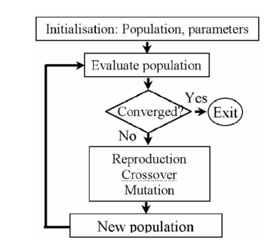

## Genetic Algorithm(GA) Optimization with MATLAB

* GA is part of a group of Evolutionary algorithms(EA).Genetic algorithms are direct,parallel and stochastic method for global search and optimization.It's independent of initial conditions and doesn't require derivative information.
* Here, our aim is to minimize predetermined objective function(total mass in our study~single objective optimization), which is `total_mass=mass_structure+mass_epoxy+mass_magnet+mass_copper+mass_steel` in our matlab .m file
* For this purpose MATLAB `optimtool()` function and its gui will be used 
* Constrains are mainly some of the design parameters which are choosed by user, for example : number of phases, air-gap length, rotational speed,axial length.
* Penalty factor will be used in order to convert constrained optimization to unconstrained optimization.
* Generally, a GA flowchart is given as follows, 

* EA mimics natural selection of living beings. Fittest one in the group has more chance to survive and to be selected. In optimization case groups correspond to populations and individuals in it. Individuals correspond to solutions of given problem. Every individual has a fitness value which is calculated by objective function of problem. In EA, there are three main principles of this process: selection, crossover and mutation. These are called **genetic operators** and their main goal is to create and maintain diversity among generations just as it is in nature.  
